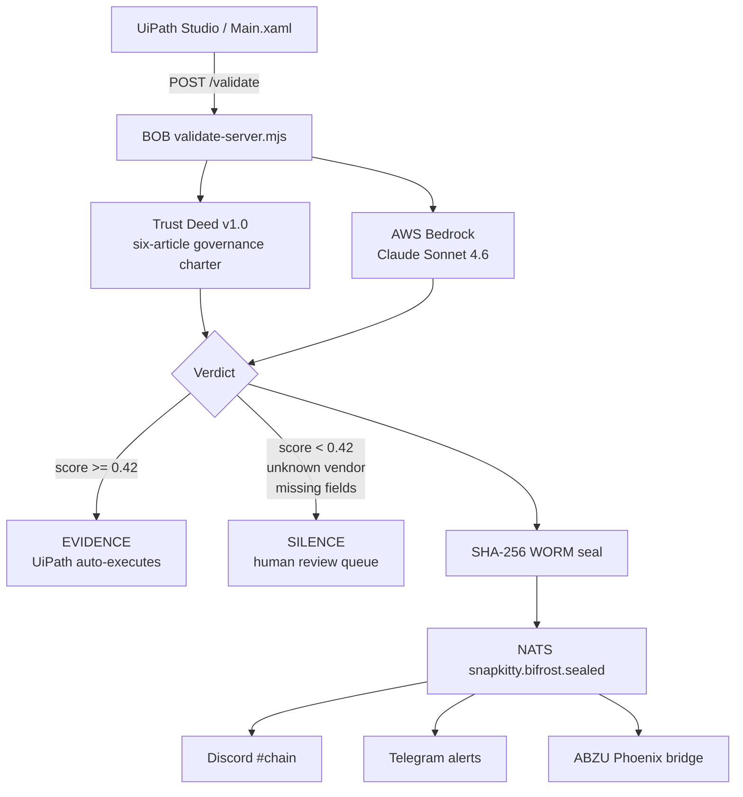

# BOB - Sovereign Compliance Agent for UiPath

> UiPath AgentHack 2026, Track 1: Maestro Case<br>
> Evidence or Silence. Nothing in between.

[](https://uipath-agenthack.devpost.com/)
[](#uipath-components-used)
[](#run-bob)
[](#what-bob-does)
[](#formal-guarantees)
[](LICENSE)

## Start Here

| Need | Link |
|---|---|
| See the live submission page | [snapkittywest.github.io/bob-hackathon-demo](https://snapkittywest.github.io/bob-hackathon-demo/) |
| Run BOB locally | [Run BOB](#run-bob) |
| Understand the architecture | [Architecture](#architecture) |
| Copy Devpost text | [Submission copy](#submission-copy) |
| See formal guarantees | [Formal guarantees](#formal-guarantees) |
| Review UiPath pieces | [UiPath components used](#uipath-components-used) |

## What BOB Does

BOB is a sovereign compliance agent for UiPath workflows.

A UiPath Robot submits a document or compliance query. BOB evaluates it under the **Bel Esprit D'Accord Trust Deed v1.0**, calls **Claude Sonnet 4.6 through AWS Bedrock**, and returns one of two verdicts:

```json
{
  "verdict": "EVIDENCE",
  "score": 0.87,
  "reasoning": "The invoice contains the required vendor, amount, and invoice ID fields.",
  "seal": "83c34fa2..."
}
```

- `EVIDENCE` -> UiPath may continue the workflow.
- `SILENCE` -> UiPath routes the case to human review.
- Every verdict is sealed with `SHA256(verdict:score:query:timestamp)`.

## Architecture



<details>
<summary><strong>ASCII Architecture</strong></summary>

```text
UiPath Studio -> Main.xaml -> POST localhost:7474/validate
                                  |
                                  v
                    BOB validate-server.mjs
                    - Claude Sonnet 4.6 via AWS Bedrock
                    - Trust Deed v1.0, six articles
                    - strict JSON verdict format
                    - threshold: score >= 0.42
                    - SHA-256 WORM seal
                                  |
                                  v
                    NATS snapkitty.bifrost.sealed
                    |-- Discord #chain verdict feed
                    |-- Telegram alert path
                    |-- ABZU Phoenix API bridge

Optional ABZU path:

UiPath -> POST /api/validate on Phoenix :4000
       -> NATS snapkitty.agents.operator
       -> BOB
       -> NATS snapkitty.bifrost.sealed
       -> Phoenix PubSub verdict:{request_id}
       -> UiPath receives sealed JSON
```

</details>

## UiPath Components Used

- **UiPath Studio / Studio Web**: workflow authoring.
- **UiPath Robot**: executes the document validation process.
- **Track 1 Maestro Case pattern**: dynamic case routing with exception paths.
- **Human review queue**: receives every `SILENCE` verdict.
- **HTTP integration**: calls `POST localhost:7474/validate`.
- **Optional ABZU bridge**: Phoenix `/api/validate` endpoint routes through NATS.

## Run BOB

### Prerequisites

- Node.js 20+
- AWS credentials configured for Bedrock
- Access to Claude Sonnet 4.6 on AWS Bedrock
- Optional: local NATS server on `localhost:4222`

### Install

```bash
npm install
```

### Start the validate server

```bash
npm run validate
```

BOB starts on:

```text
http://localhost:7474
```

### Health check

```bash
curl http://localhost:7474/health
```

### Submit a validation query

```bash
curl -X POST http://localhost:7474/validate \
  -H "Content-Type: application/json" \
  -d "{\"query\":\"Invoice INV-1001 from approved vendor ACME for $450 with invoice ID and amount present.\"}"
```

### Expected response shape

```json
{
  "request_id": null,
  "verdict": "EVIDENCE",
  "score": 0.87,
  "seal": "83c34fa2d9f1...",
  "reasoning": "The invoice contains the required fields and is under the auto-approval threshold.",
  "brain": "Claude Sonnet 4.6",
  "trust_deed": "Bel Esprit D'Accord Trust v1.0",
  "ts": 1782690000000
}
```

## NATS Event Mesh

| Channel | Subject |
|---|---|
| BOB inbox | `snapkitty.agents.operator` |
| Sealed verdicts | `snapkitty.bifrost.sealed` |
| Server | Docker `snapkitty-nats`, port `4222`, token auth, JetStream |

<details>
<summary><strong>Runtime behavior</strong></summary>

`validate-server.mjs` listens on both:

- HTTP: `POST localhost:7474/validate`
- NATS: `snapkitty.agents.operator`

Every successful validation publishes a sealed verdict to:

```text
snapkitty.bifrost.sealed
```

</details>

## Trust Deed v1.0

The Trust Deed is not prompt decoration. It is the binding governance charter.

<details>
<summary><strong>Article summary</strong></summary>

```text
Article I   - Identity
Article II  - Truth Mandate
Article III - Compliance Protocol
Article IV  - Verdict Format
Article V   - Evidence Threshold
Article VI  - Human Review Guarantee
```

Key runtime rules:

- Required fields: vendor, amount, invoice ID.
- Auto-approve threshold: amount <= $10,000.
- Unknown vendor: `SILENCE`.
- Weak evidence: `SILENCE`.
- Strict JSON only.
- Threshold: `score >= 0.42` permits `EVIDENCE`.

</details>

## Formal Guarantees

<details open>
<summary><strong>Verdict Completeness</strong></summary>

```text
For every submitted document packet d,
BOB(d) returns exactly one verdict:

  EVIDENCE
  SILENCE

There is no third state.
```

</details>

<details>
<summary><strong>WORM Integrity</strong></summary>

```text
seal(v,s,q,t) = SHA256(v | s | q | t)

If verdict, score, query, or timestamp
is changed after emission, the seal no
longer verifies.
```

</details>

<details>
<summary><strong>Trust Deed Soundness</strong></summary>

```text
If Trust Deed policy blocks action a,
model output cannot authorize a.

The charter constrains the model.
The model does not rewrite the charter.
```

</details>

<details>
<summary><strong>Human-in-Loop Guarantee</strong></summary>

```text
BOB(d) = SILENCE
  implies
d enters the human review queue.

Unsupported automation cannot silently continue.
```

</details>

<details>
<summary><strong>Zero Hallucination Corollary</strong></summary>

```text
BOB cannot issue a confident unsupported approval
because below-threshold or unsupported claims
collapse to SILENCE.
```

</details>

## Demo Script

Use this for the 5-minute Devpost video.

1. Start BOB with `npm run validate`.
2. Show `/health`.
3. In UiPath, submit a compliant invoice/query.
4. Show `EVIDENCE`, score, reasoning, and SHA-256 seal.
5. Submit an unknown vendor or incomplete document.
6. Show `SILENCE`.
7. Show the workflow path to human review.
8. Show NATS/Discord/Telegram event feed if available.
9. Explain that Claude Code was used as the coding agent for the build.

## Submission Copy

<details>
<summary><strong>Copy/paste Devpost Inspiration</strong></summary>

We built BOB in one day for UiPath AgentHack 2026. The idea was simple: every enterprise AI agent makes decisions, but almost none of them can prove what happened afterward.

When an AI approves an invoice, routes a compliance case, or escalates a vendor exception, the audit record needs more than a transcript. It needs a governed verdict, a human-in-loop path, and tamper evidence.

BOB fixes that with one rule: Evidence or Silence. Nothing in between.

</details>

<details>
<summary><strong>Copy/paste What it does</strong></summary>

A UiPath Robot submits a document or compliance query. BOB evaluates it under the Bel Esprit D'Accord Trust Deed v1.0, a six-article governing charter, then calls Claude Sonnet 4.6 through AWS Bedrock.

If the score is at or above 0.42, BOB returns EVIDENCE and UiPath may continue. If evidence is weak, the vendor is unknown, fields are missing, or the model cannot ground the answer, BOB returns SILENCE and the workflow routes to human review.

Every verdict is sealed with SHA-256. Tamper with the verdict, score, query, or timestamp and the seal breaks.

</details>

<details>
<summary><strong>Copy/paste What's next</strong></summary>

Next for BOB: a full Maestro Case for invoice-to-payment, UiPath Document Understanding for OCR ingestion, a public Trust Deed registry, an ABZU LiveView dashboard for verdict monitoring, and expanded alert routing for Telegram and Discord.

</details>

## Repositories

| Purpose | Repository |
|---|---|
| BOB source | [SNAPKITTYWEST/bob-orchestrator](https://github.com/SNAPKITTYWEST/bob-orchestrator) |
| Public submission site | [SNAPKITTYWEST/bob-hackathon-demo](https://github.com/SNAPKITTYWEST/bob-hackathon-demo) |
| Submission page | [snapkittywest.github.io/bob-hackathon-demo](https://snapkittywest.github.io/bob-hackathon-demo/) |
| ABZU bridge | [SNAPKITTYWEST/abzu-sovereign-ide](https://github.com/SNAPKITTYWEST/abzu-sovereign-ide) |

## License

Apache-2.0.
